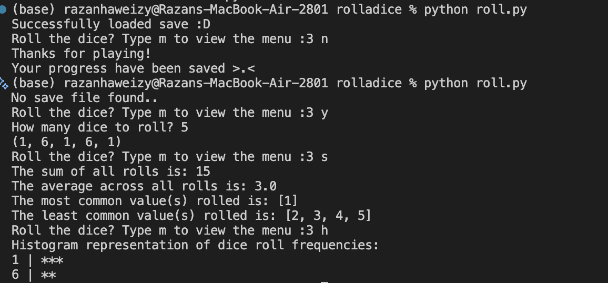

# Dice Rolling Simulator

A feature-rich command-line dice rolling simulator with statistical tracking, data persistence, and support for multiple die types. Perfect for tabletop RPG enthusiasts, probability studies, or anyone interested in dice mechanics.

## Features

### Core Functionality
- **Multi-Die Rolling**: Roll multiple dice simultaneously with a single command
- **Statistical Analysis**: Track comprehensive statistics including sum, average, most/least common rolls
- **Visual Histogram**: View frequency distribution of your rolls in an ASCII histogram format
- **Multiple Die Types**: Support for standard tabletop gaming dice (d4, d6, d8, d10, d12, d20, d100)

### Data Management
- **Save/Load System**: Persistent storage using JSON serialization
- **Auto-save on Exit**: Progress automatically saved when terminating the program
- **Manual Save Points**: Save your progress at any time without exiting
- **Session Reset**: Reset statistics while preserving the ability to load previous sessions

### User Experience
- **Interactive Menu**: Intuitive command-based interface
- **Input Validation**: Robust error handling for all user inputs
- **Real-time Updates**: Statistics update dynamically after each roll
- **Progress Tracking**: Monitor total number of dice rolled across your session

## Technical Skills Demonstrated

### Python Programming
- Object-oriented design principles
- Dictionary and list manipulation
- String formatting and parsing
- Control flow and loop management
- Global state management

### Data Structures & Algorithms
- Hash maps (dictionaries) for O(1) lookup operations
- Counter implementation for frequency analysis
- Data aggregation and statistical calculations
- Dynamic data structure population

### File I/O & Serialization
- JSON encoding/decoding
- File system operations (`os` module)
- Exception handling for file operations
- Data type conversion and preservation

### Error Handling
- Try-except blocks for robust error catching
- Input validation with user-friendly feedback
- Graceful handling of edge cases (empty data, invalid inputs)
- File existence checking and creation

### Software Design Patterns
- Separation of concerns (dedicated functions for each feature)
- Helper function architecture
- State management across function calls
- Modular, maintainable code structure

### User Interface Design
- Command-line interface (CLI) design
- Menu-driven navigation
- Clear user feedback and prompting
- Progress indicators and notifications

## Installation

1. Clone the repository:
```bash
git clone https://github.com/Razanhaweizy/Dice-Simulator.git
cd Dice-Simulator
```

2. Ensure Python 3.x is installed:
```bash
python --version
```

3. Run the program:
```bash
python roll.py
```

## Usage

### Quick Start
```
Roll the dice? Type m to view the menu :3 
> y
How many dice to roll? 3
(4, 2, 6)
```

### Available Commands
| Command | Description |
|---------|-------------|
| `y` | Roll dice |
| `n` | Exit program (auto-saves) |
| `c` | View total dice rolled |
| `s` | Display statistics |
| `h` | Show histogram |
| `f` | Change die face (resets stats) |
| `r` | Reset all statistics |
| `v` | Save progress manually |
| `l` | Load previous save |
| `m` | Display menu |

### Example Session



## Project Structure

```
Dice-Simulator/
├── roll.py             # Main program file
├── save.txt            # Generated save file (JSON format)
├── example.png         # Example demo
└── README.md           # Project documentation

```

## Data Persistence

Progress is automatically saved in `save.txt` as JSON with the following structure:
```json
{
  "dice_counter": 42,
  "die_face": 6,
  "stats_dict": {
    "sum_rolls": 147,
    "average": 3.5,
    "most_common": [3, 4],
    "least_common": [1]
  },
  "num_count": {
    "1": 5,
    "2": 8,
    "3": 10,
    "4": 10,
    "5": 6,
    "6": 3
  }
}
```

## Future Enhancements

- Add weighted dice probability calculations
- Implement roll history with timestamps
- Add dice pool mechanics for RPG systems
- Support for custom die faces

## Requirements

- Python 3.x
- No external dependencies (uses only standard library)

## License

This project is open source and available under the MIT License.

## Author

Razan Haweizy

---

**Note**: This simulator uses Python's `random` module which is suitable for gaming and educational purposes but should not be used for cryptographic applications.
